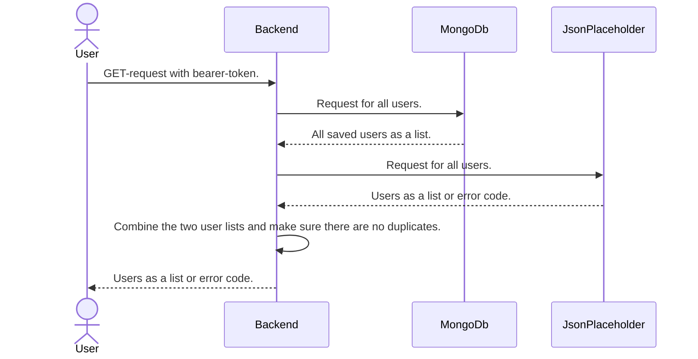
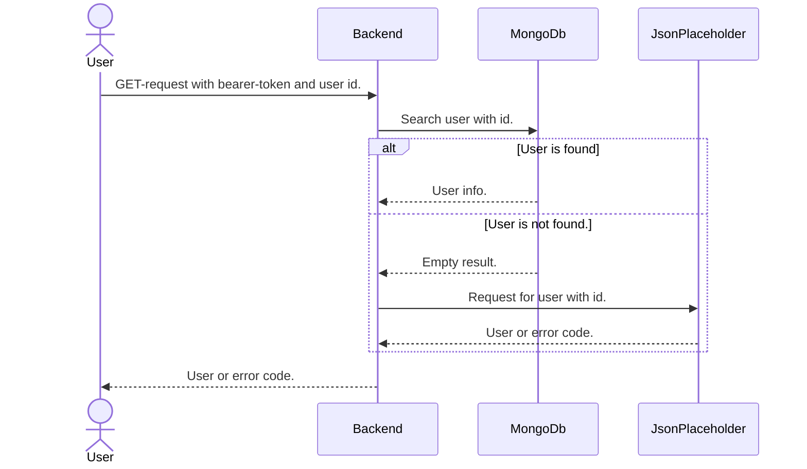
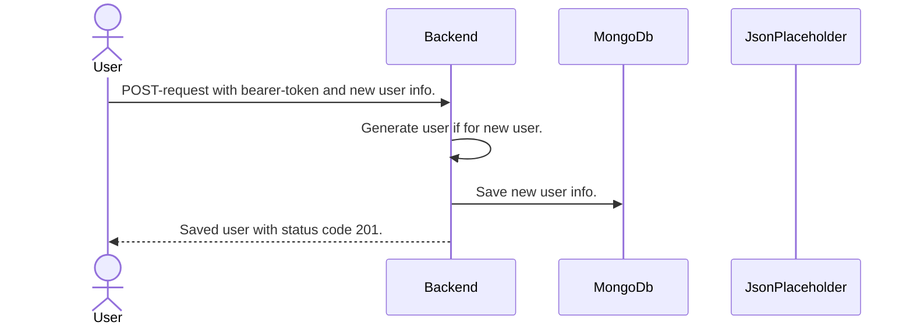
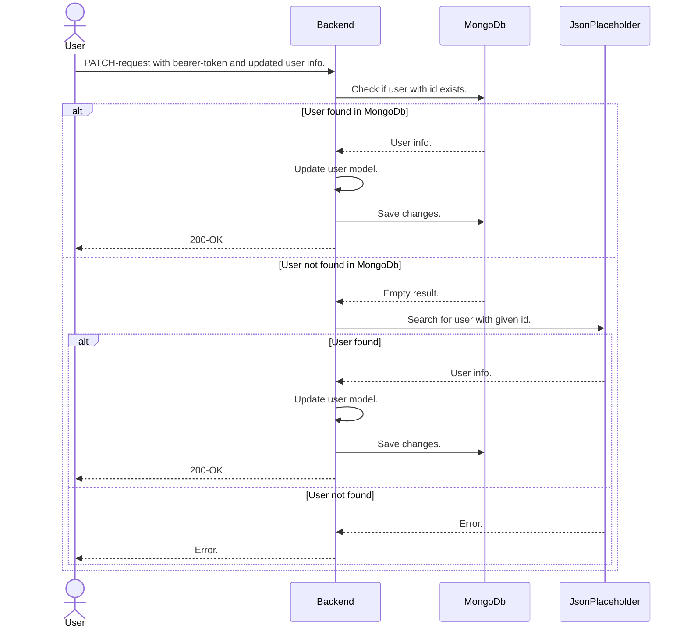

# Backend showcase with JsonPlaceholder

This is a backend project built with Rust, Reqwest, Tokio and Actix-web and meant as a showcase.

The goal is to provide a secure REST api for reading and updating User info in [JsonPlaceholder](https://jsonplaceholder.typicode.com).

> Because JsonPlaceholder does not support editing or saving user info, we use MongoDb under the hood. This part of the service is meant to be invisible to the end user, hence all APIs act as if they only communicate with JsonPlaceholder.

#### Swagger

> Not yet implemented.

Swagger is provided at path `/swagger`.

#### Documentation

This README-file is provided via [Docsify](https://docsify.js.org/#/quickstart) at the project root url `/`.

## Authentication

> Not yet implemented.

The REST apis provided by this project have been secured with OIDC and require a bearer-token provided by an identity manager.

This project has been tested and built against [Keycloak](https://www.keycloak.org).

## Operations

Documentation for all the data flows in this project.

For info about the REST apis, see [swagger](#swagger)

### Get users

Get a list of all users.

> Roles allowed: "admin", "user"

### Get user with id

Get user with specific id.

> Roles allowed: "admin", "user"

### Create new user

Create new user.

> Roles allowed: "admin"

### Update existing user

Update existing user.

> Roles allowed: "admin"

